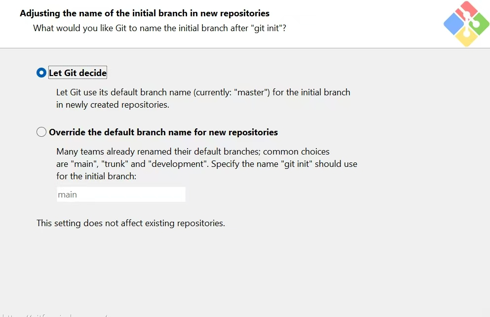
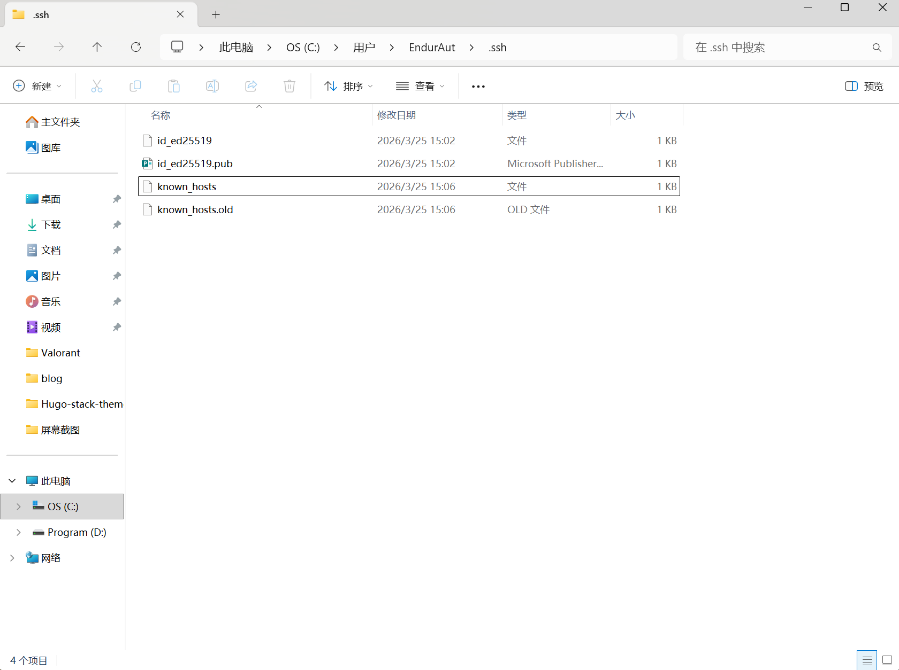

# 安装git
## 安装时设置分支
打开安装程序安装会有如下图所示界面  
  
如果你的github库分支是`master` 则选择第一个 若不是则选择第二个,并在方框里填写对应的分支id,修改安装路径后全部下一步    

## 创建SSH密钥
在git bash 或 cmd powershell等命令行窗口输入下方指令  
`ed25519` 和 `rsa` 分别代表不同的密钥类型 首选`ed25519` 在旧系统不支持时可选择`rsa`  
```bash
ssh-keygen -t ed25519 -C "修改为你的邮箱及GitHub登陆邮箱"
```
```bash
ssh-keygen -t rsa -b 4096 -C "修改为你的邮箱及GitHub登陆邮箱"
```
## 确定SSH密钥保存位置  
输入指令后命令行会提示
```bash
Enter file in which to save the key (C:\Users\EndurAut/.ssh/id_ed25519):
```
以我的电脑为例,提示结果表明,按下回车key保存在这个路径  

## 给予SSH密钥设置密码
key保存后命令行则会提示
```bash
 Enter passphrase (empty for no passphrase):
 ```
 推荐在私人电脑上设置`空密码` 及`回车` ,否则设置自己的密码  
 
 ## 二次确认给予SSH密钥设置的密码
 命令行最后提示下述展示 此次为`二次确认` ,如果设置密码则再次输入一边,若 `空密码` 则 `回车`  
 ```bash
 Enter passphrase (empty for no passphrase): Enter same passphrase again:
```
回车后即可在上述路径看到两个文件  

## SSH密钥文件说明
以我的为例  
  
会生成两个密钥文件分别是  
- id_ed25519.pub
- id_ed25519

`id_ed25519.pub` 为公钥文件 可以公布 下面GitHub要求上传的`SSH密钥`则上传 `id_ed25519.pub`文件里的内容,记事本打开即可  
`id_ed25519` 为私钥文件 不可以泄露任何人  

## GitHub添加SSH密钥  
登录GitHub网页,依次点击 `头像` → `setting` → `SSH and GPG keys` → 选择 `New SSH key` → `title`中填写此SSH的备注即可 → `key type` 选择 `Authentication Key` → `key`内容填写 `id_ed25519.pub` 公钥文件 → 点击 `Add SSH key` 即可完成 `GitHub` 密钥添加   

## git连接GitHub  
创建GitHub仓库 并找到与下方相似的地址
```bash
git@github.com:你的用户名/仓库名.git
```
在命令行窗口进入要上传到仓库的文件夹并输入进行git初始化
```bash
git init
```
初始化后输入下方指令把GitHub仓库的SSH地址添加为远程仓库
```bash
git remote add origin git@github.com:HY060114/HY060114.github.io.git
```
`git@github.com:HY060114/HY060114.github.io.git` 这段则修改为自己的远程仓库 
添加后测试SSH是否连接GitHub,输入下方指令
```bash
ssh -T git@github.com
```
若成功则会显示
```bash
C:\Users\EndurAut\Desktop\blog>ssh -T git@github.com The authenticity of host 'github.com (20.205.243.166)' can't be established. ED25519 key fingerprint is SHA256:+DiY3wvvV6TuJJhbpZisF/zLDA0zPMSvHdkr4UvCOqU. This key is not known by any other names. Are you sure you want to continue connecting (yes/no/[fingerprint])
```
或者
```bash
Hi HY060114! You've successfully authenticated...
```
显示第一个因为GitHub服务器指纹未添加你的`known_hosts`文件,只需要输入 `yes` GitHub的服务器指纹会被保存到和SSH密钥同一个文件夹,同时输入 `yes` 后通常会显示  
```bash
Hi HY060114! You've successfully authenticated...
```
这代表git连接GitHub成功  

## 通过git上传文件到GitHub远程仓库
首先在项目目录执行下述指令初始化Git  
```bash
git init
```
添加所有文件  
```bash
git add .
```
添加到预修改区域
```bash
git commit -m "此处为注释按需求填写"
```
最后提交到远程GitHub仓库
```bash
git push
```
若后续只修改了个别文件则可
```bash
git add "此处为修改的文件路径"
```
添加后再次使用 `commit` 和 `push` 即可同步更新远程仓库文件  


